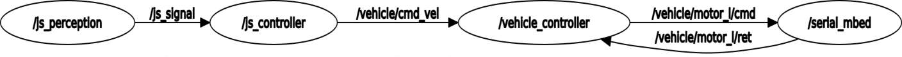

# inaho vehicle

## About

Vehicle control software with ROS

This software is released under the MIT License, see LICENSE.txt.


## ROS nodes

* [js_perception](http://wiki.ros.org/joy): Convert joystick signal to ROS topic (Joy)
* [js_controller](./joystick): Convert `js_signal (Joy)` to `cmd_vel (Twist)`
* [vehicle_controller](./vehicle): Convert `cmd_vel (Twist)` to the speed/direction of each motor
* [serial_mbed](./mbed): Bridge communication between ROS and USB serial to Mbed

## ROS messages




## Requirement

* [Docker](https://docs.docker.com/install)
* [Docker Compose](https://docs.docker.com/compose/install/)

## Setup

Please see [INSTALL](./doc/INSTALL.md).

## Usage

Please execute the following commands in the root directory of `inaho_vehicle`.

### Build

```shell
docker-compose build
```

### Run

```shell
docker-compose up -d
```

### Stop

```shell
docker-compose down
```

### View logs

```shell
docker-compose logs
```
